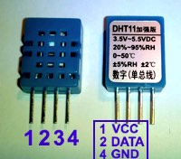
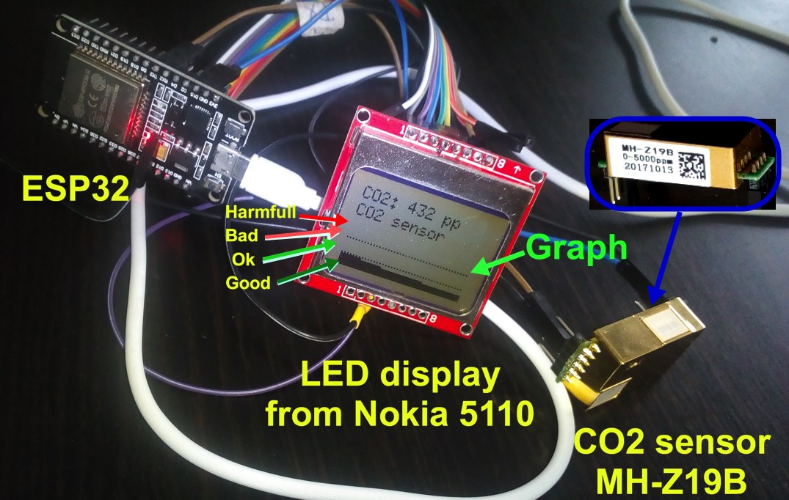
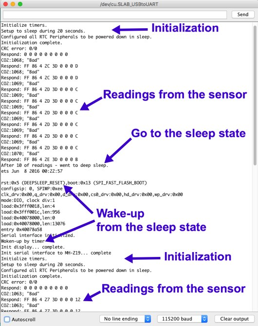

# The ESP32 with CO2 sensor MH-Z19B (v2) and LCD display from Nokia 5110.
There are few ways to read data from the sensor:
* from PWM output 
* from serial port
* from V0 - analog output (not checked)

This project uses the serial port (works more stable).

Connect the sensor, when data are read from the sensor's serial port.
```
  ESP32        | CO2 sensor MH-Z19B
  pin 16 (RX2) - RX
  pin 17 (TX2) - TX
  GND          - GND
  +5V          - Vin
```
Temperature and humidity sensor DHT-11
```
ESP32  | Temperature and humidity sensor DHT-11
  +3.3V  - 1 (see an image below)
  pin 21 - 2
  (NC)   - 3
  GND    - 4
```  
Connect the display
```
  ESP32  | Display Nokia 5110
  pin 14 - Serial clock out: CLK (SCLK)
  pin 13 - Serial data out: DIN
  pin 27 - Data/Command select: DC (D/C)
  pin 15 - LCD chip select: CE (CS)
  pin 26 - LCD reset: RST
  5V    - VCC
  GND   - GND
```
The project uses the display library [U8g2](https://github.com/olikraus/U8g2_Arduino)([download](https://github.com/olikraus/U8g2_Arduino/archive/master.zip)), which supports large number of [display types](https://github.com/olikraus/u8g2/wiki/u8g2setupcpp) (set in the code a selected display from [this list](https://github.com/olikraus/u8g2/blob/master/tools/inoupdate/frame_buffer.ino)).

[Similar project on an Arduino](https://github.com/satr/arduino-with-co2-sensor-mh-z19b-and-lcd-display-nokia-5110). This project uses [Adafruit GFX Library](https://github.com/adafruit/Adafruit-GFX-Library) and [Adafruit PCD8544 Nokia 5110 LCD library](https://github.com/adafruit/Adafruit-PCD8544-Nokia-5110-LCD-library).

For support of the temperature and humidity sensor DHT-11 - it is used a library  https://github.com/RobTillaart/Arduino/tree/master/libraries/DHTstable (download, zip, install to Arduino)



Basic setup:



Serial interface log - demonstration of a deep sleep mode ([sketch with sleep state](esp32-mh-z19b-lcd-5110-with-deep-sleep-sketch/esp32-mh-z19b-lcd-5110-with-deep-sleep-sketch.ino))

